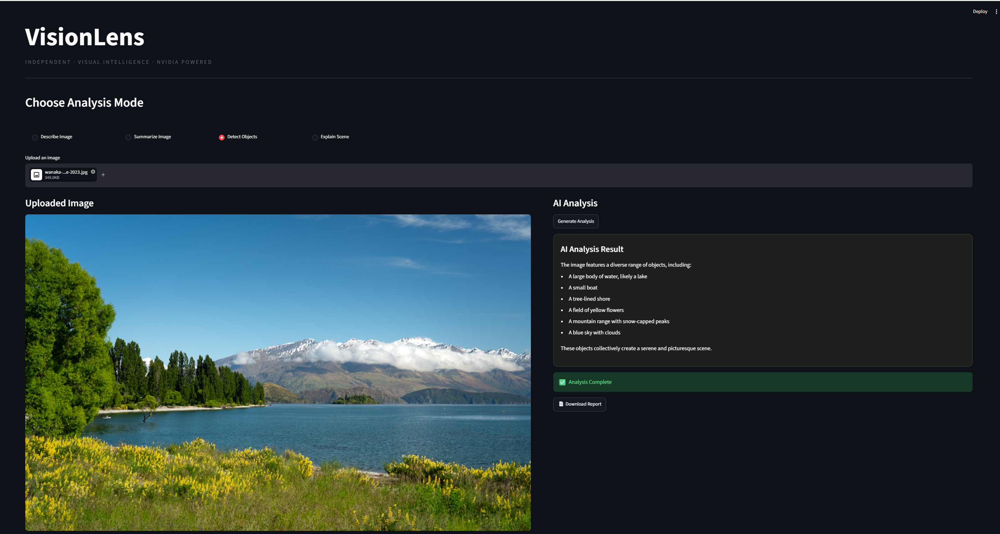

# VisionLens

VisionLens is an AI-powered image analysis application built using Streamlit and NVIDIA NIM Vision Models. Users can upload an image and receive intelligent insights generated by an AI vision model.

---

## Features

- Describe Image
  - Generates a detailed description of the uploaded image.

- Summarize Image
  - Provides a concise summary of the image.

- Detect Objects
  - Identifies visible objects present in the image.

- Explain Scene
  - Explains the context and activities happening in the image.

- Download Report
  - Export AI-generated analysis as a text file.

---

## Technologies Used

- Python
- Streamlit
- NVIDIA NIM API
- Llama 3.2 Vision Instruct Model
- Requests
- Python Dotenv

---

## Project Structure

```text
VisionLens/
│
├── app.py
├── requirements.txt
├── .gitignore
├── README.md
└── .env (not uploaded to GitHub)
```

---

## Installation

### 1. Clone Repository

```bash
git clone https://github.com/Sahil-Khandare/VisionLens.git
cd VisionLens
```

### 2. Install Dependencies

```bash
pip install -r requirements.txt
```

### 3. Create .env File

Create a file named `.env` and add:

```env
NVIDIA_API_KEY=your_api_key_here
```

---

## Run Application

```bash
streamlit run app.py
```

The application will open at:

```text
http://localhost:8501

### Analysis Example


